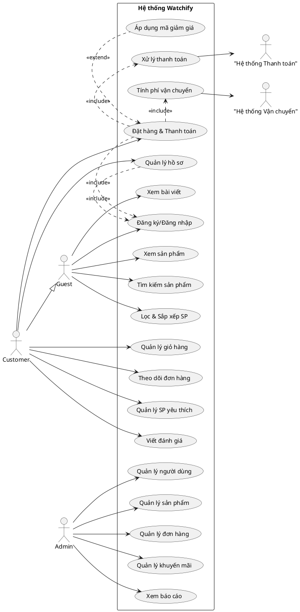

# **Tài liệu Phân tích Usecase - Dự án Watchify**

- **Ngày tạo:** 13/09/2025
- **Phiên bản:** 1.0

## **1. Giới thiệu**

### **1.1. Mục đích tài liệu**
Tài liệu này nhằm mục đích phân tích và định nghĩa các trường hợp sử dụng (usecase) của hệ thống "Watchify — Website giới thiệu và bán đồng hồ trực tuyến". Mục tiêu là cung cấp một cái nhìn tổng quan, chi tiết về các chức năng mà hệ thống sẽ cung cấp cho các đối tượng người dùng khác nhau.

Tài liệu này sẽ là cơ sở để:
-   Đội ngũ phát triển (Development Team) hiểu rõ các yêu cầu chức năng.
-   Đội ngũ thiết kế (UI/UX Team) xây dựng giao diện và trải nghiệm người dùng phù hợp.
-   Đội ngũ kiểm thử (QA/QC Team) xây dựng các kịch bản kiểm thử (test cases).

### **1.2. Tổng quan dự án**
Dự án "Watchify" hướng đến xây dựng một nền tảng thương mại điện tử chuyên nghiệp, thẩm mỹ và dễ sử dụng, tập trung vào việc giới thiệu và kinh doanh đồng hồ cao cấp và phổ thông. Hệ thống không chỉ là một kênh bán hàng mà còn là một kênh xây dựng thương hiệu, cung cấp thông tin chuyên sâu về sản phẩm và tối ưu hóa trải nghiệm mua sắm từ đầu đến cuối cho khách hàng.

## **2. Xác định các Tác nhân (Actors)**

Các tác nhân là những đối tượng (người dùng hoặc hệ thống bên ngoài) tương tác trực tiếp với hệ thống Watchify.

| Tác nhân | Mô tả |
| :--- | :--- |
| **Khách truy cập (Guest)** | Người dùng chưa đăng nhập vào hệ thống. Họ có thể truy cập các chức năng công khai như xem sản phẩm, đọc bài viết. |
| **Khách hàng (Customer)** | Người dùng đã đăng ký và đăng nhập vào hệ thống. Họ có đầy đủ quyền của Khách truy cập, cùng với các chức năng cá nhân hóa như quản lý giỏ hàng, đặt hàng, theo dõi đơn hàng. |
| **Quản trị viên (Admin)** | Nhân viên của Watchify, chịu trách nhiệm quản lý vận hành toàn bộ hệ thống website, từ sản phẩm, đơn hàng, khuyến mãi đến báo cáo kinh doanh. |
| **Hệ thống thanh toán** | Một hệ thống bên thứ ba (ví dụ: cổng thanh toán VNPAY, Stripe) chịu trách nhiệm xử lý các giao dịch thanh toán trực tuyến. |
| **Hệ thống vận chuyển** | Một hệ thống bên thứ ba chịu trách nhiệm cung cấp API để tính toán phí vận chuyển và có thể cập nhật trạng thái giao hàng. |
| **Hệ thống Email/SMS** | Dịch vụ bên thứ ba được sử dụng để gửi các thông báo tự động (xác nhận đơn hàng, cập nhật trạng thái, v.v.) đến khách hàng. |

## **3. Phân tích Usecase**

### **3.1. Usecase cho Khách truy cập (Guest)**

-   **Xem danh mục sản phẩm:** Duyệt qua tất cả các sản phẩm đồng hồ.
-   **Xem chi tiết sản phẩm:** Xem thông tin chi tiết, hình ảnh chất lượng cao, thông số kỹ thuật, đánh giá của sản phẩm.
-   **Tìm kiếm sản phẩm:** Tìm kiếm sản phẩm theo tên, thương hiệu hoặc từ khóa.
-   **Lọc sản phẩm:** Lọc sản phẩm theo các tiêu chí: giá, thương hiệu, bộ sưu tập, kích thước, tính năng.
-   **Sắp xếp sản phẩm:** Sắp xếp danh sách sản phẩm theo giá, mức độ phổ biến, sản phẩm mới nhất.
-   **Xem bài viết chuyên môn:** Đọc các bài viết, tin tức, lịch sử thương hiệu.
-   **Xem chương trình khuyến mãi:** Xem các chương trình khuyến mãi đang diễn ra.

### **3.2. Usecase cho Khách hàng (Customer)**

Khách hàng có tất cả các usecase của Khách truy cập, cộng thêm:

-   **Đăng ký tài khoản:** Tạo tài khoản mới bằng email và mật khẩu.
-   **Đăng nhập/Đăng xuất:** Đăng nhập vào hệ thống bằng email hoặc tài khoản mạng xã hội (Google/Facebook), và đăng xuất.
-   **Quản lý hồ sơ cá nhân:** Cập nhật thông tin cá nhân, địa chỉ giao hàng, mật khẩu.
-   **Quản lý giỏ hàng:** Thêm sản phẩm vào giỏ, thay đổi số lượng, xóa sản phẩm khỏi giỏ.
-   **Quản lý sản phẩm yêu thích:** Lưu các sản phẩm quan tâm vào một danh sách riêng.
-   **Đặt hàng và thanh toán:** Thực hiện quy trình checkout, điền thông tin giao hàng, chọn phương thức thanh toán và hoàn tất đơn hàng.
-   **Áp dụng mã giảm giá:** Sử dụng mã khuyến mãi trong quá trình thanh toán.
-   **Xem lịch sử giao dịch:** Xem lại danh sách các đơn hàng đã đặt.
-   **Theo dõi trạng thái đơn hàng:** Kiểm tra tình trạng hiện tại của đơn hàng (đang xử lý, đang giao, đã giao).
--   **Viết đánh giá sản phẩm:** Để lại bình luận và xếp hạng cho các sản phẩm đã mua.
-   **Yêu cầu hỗ trợ hậu mãi:** Gửi yêu cầu đổi/trả hàng hoặc các hỗ trợ khác.

### **3.3. Usecase cho Quản trị viên (Admin)**

-   **Đăng nhập hệ thống quản trị:** Truy cập vào dashboard quản lý với cơ chế xác thực an toàn.
-   **Quản lý sản phẩm:** Thêm, sửa, xóa, nhập/xuất danh sách sản phẩm, quản lý hình ảnh và mô tả.
-   **Quản lý tồn kho:** Cập nhật số lượng tồn kho cho từng sản phẩm.
-   **Quản lý đơn hàng:** Xem danh sách đơn hàng, xác nhận, xử lý, cập nhật trạng thái và duyệt yêu cầu đổi/trả hàng.
-   **Quản lý khách hàng:** Xem thông tin và lịch sử mua hàng của khách hàng.
-   **Quản lý chương trình khuyến mãi:** Tạo và quản lý các mã giảm giá, quà tặng.
-   **Quản lý nội dung:** Tạo và chỉnh sửa các bài viết chuyên môn, thông tin thương hiệu.
-   **Xem báo cáo thống kê:** Theo dõi báo cáo doanh thu, sản phẩm bán chạy, phân tích tồn kho.
-   **Quản lý phân quyền:** Quản lý tài khoản và phân quyền cho các nhân viên nội bộ.
-   **Xem nhật ký hệ thống:** Truy vết các thao tác quan trọng trong hệ thống quản trị.

## **4. Mô tả chi tiết Usecase chính**

### **4.1. Usecase: Đặt hàng và Thanh toán**

-   **Tác nhân chính:** Khách hàng (Customer)
-   **Mô tả ngắn gọn:** Usecase này mô tả quá trình khách hàng chọn sản phẩm trong giỏ hàng, cung cấp thông tin giao nhận, chọn phương thức thanh toán và hoàn tất việc mua hàng.
-   **Điều kiện tiên quyết:**
    -   Khách hàng đã đăng nhập vào hệ thống.
    -   Giỏ hàng có ít nhất một sản phẩm.
-   **Luồng sự kiện chính (Happy Path):**
    1.  Khách hàng truy cập trang giỏ hàng và chọn "Tiến hành thanh toán".
    2.  Hệ thống hiển thị trang checkout, yêu cầu khách hàng xác nhận/nhập địa chỉ giao hàng.
    3.  Hệ thống tự động tính toán phí vận chuyển dựa trên địa chỉ và hiển thị tổng số tiền.
    4.  Khách hàng chọn một phương thức thanh toán (Thẻ tín dụng, Chuyển khoản, Ví điện tử).
    5.  Khách hàng nhập thông tin thanh toán cần thiết.
    6.  Khách hàng xác nhận đơn hàng.
    7.  Hệ thống gửi yêu cầu xử lý thanh toán đến **Hệ thống thanh toán** bên ngoài.
    8.  **Hệ thống thanh toán** xử lý và trả về kết quả thành công.
    9.  Hệ thống ghi nhận đơn hàng vào cơ sở dữ liệu, cập nhật trạng thái "Chờ xử lý" và trừ tồn kho sản phẩm.
    10. Hệ thống hiển thị trang thông báo đặt hàng thành công cho khách hàng.
    11. Hệ thống gửi email xác nhận đơn hàng cho khách hàng thông qua **Hệ thống Email/SMS**.
-   **Luồng sự kiện thay thế:**
    -   **4a. Áp dụng mã giảm giá:** Trước bước 6, khách hàng nhập mã giảm giá hợp lệ. Hệ thống sẽ xác thực mã và cập nhật lại tổng số tiền.
    -   **8a. Thanh toán thất bại:** **Hệ thống thanh toán** trả về kết quả thất bại. Hệ thống thông báo lỗi cho khách hàng và cho phép họ thử lại hoặc chọn phương thức thanh toán khác. Đơn hàng không được tạo.
    -   **9a. Sản phẩm hết hàng:** Trong quá trình xử lý, nếu một sản phẩm trong giỏ đã hết hàng, hệ thống sẽ thông báo cho khách hàng và không cho phép hoàn tất đơn hàng.
-   **Điều kiện kết thúc:**
    -   (Thành công) Một đơn hàng mới được tạo trong hệ thống với trạng thái "Chờ xử lý". Khách hàng nhận được email xác nhận.
    -   (Thất bại) Đơn hàng không được tạo. Giỏ hàng của khách hàng vẫn giữ nguyên.

## **5. Sơ đồ Usecase (Usecase Diagram)**

### **5.1. Giới thiệu**
Sơ đồ dưới đây minh họa mối quan hệ giữa các tác nhân và các usecase chính trong hệ thống Watchify. Sơ đồ này giúp trực quan hóa phạm vi chức năng và sự tương tác của người dùng với hệ thống.

### **5.2. UML Script (Dành cho PlantUML)**
Bạn có thể sao chép đoạn mã dưới đây và dán vào một công cụ hỗ trợ PlantUML (như trang web PlantText, hoặc extension trong VSCode) để tạo sơ đồ.

## **6. Kết luận**
Tài liệu này đã phác thảo các chức năng cốt lõi của dự án Watchify thông qua việc phân tích các tác nhân và trường hợp sử dụng. Đây là tài liệu "sống" và sẽ được cập nhật, bổ sung trong suốt quá trình phát triển dự án dựa trên các phản hồi và yêu cầu chi tiết hơn từ đội ngũ. Các thành viên trong nhóm được khuyến khích xem xét và đóng góp ý kiến để hoàn thiện tài liệu này.
