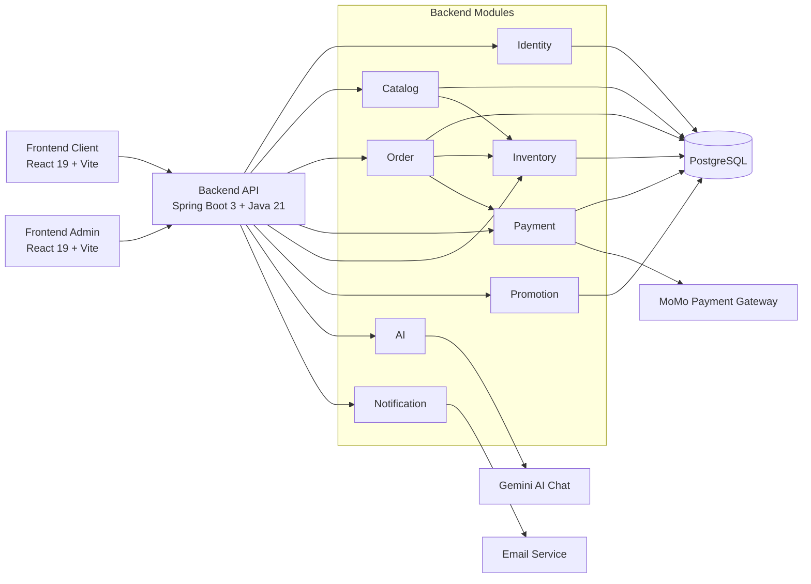
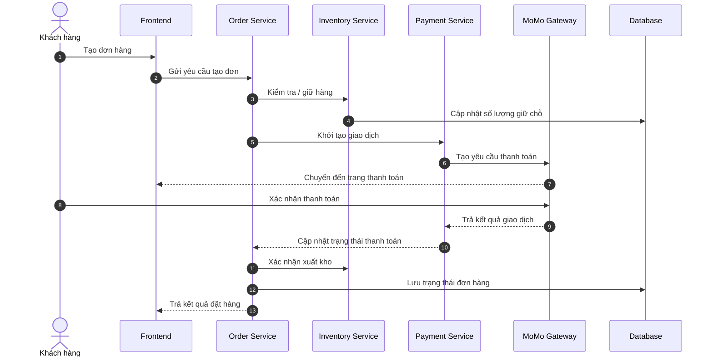

# Watchify

Watchify là một hệ thống thương mại điện tử bán đồng hồ được xây dựng theo kiến trúc full-stack, tập trung vào trải nghiệm mua sắm cho khách hàng và bộ công cụ quản trị cho người vận hành hệ thống. Dự án được tổ chức theo hướng modular monolith ở backend, kết hợp với một ứng dụng frontend hiện đại để xử lý đồng thời các luồng người dùng, quản trị sản phẩm, đơn hàng, tồn kho và thanh toán.

Mục tiêu của dự án không chỉ là mô phỏng một website bán hàng thông thường, mà là thể hiện một nền tảng có cấu trúc rõ ràng, có thể mở rộng, dễ bảo trì và phù hợp để trình bày trong hồ sơ tuyển dụng hoặc đồ án kỹ thuật.

## Tổng quan nghiệp vụ

Hệ thống bao phủ đầy đủ các luồng nghiệp vụ cốt lõi của một nền tảng bán lẻ đồng hồ:

- Quản lý danh mục sản phẩm, thương hiệu và phân loại theo nhóm khách hàng như nam, nữ, couple.
- Hiển thị chi tiết sản phẩm, hình ảnh, thuộc tính, đánh giá và danh sách yêu thích.
- Quản lý giỏ hàng, đặt hàng, theo dõi lịch sử mua hàng và thông tin hồ sơ người dùng.
- Xử lý thanh toán trực tuyến thông qua cổng MoMo.
- Quản lý tồn kho với cơ chế giữ chỗ, xác nhận và giải phóng số lượng để hạn chế overselling.
- Áp dụng coupon/khuyến mãi và theo dõi lượt sử dụng mã giảm giá.
- Cung cấp khu vực quản trị cho nhân sự nội bộ để xử lý sản phẩm, đơn hàng, người dùng, thương hiệu, đánh giá và tồn kho.
- Tích hợp chatbot AI hỗ trợ tương tác và tư vấn cơ bản cho người dùng.
- Gửi email thông báo cho các luồng nghiệp vụ quan trọng như xác thực hoặc khôi phục mật khẩu.

## Kiến trúc hệ thống


```mermaid
flowchart LR
	Client[Frontend Client\nReact 19 + Vite]
	Admin[Frontend Admin\nReact 19 + Vite]
	API[Backend API\nSpring Boot 3 + Java 21]
	DB[(PostgreSQL)]
	MoMo[MoMo Payment Gateway]
	AI[Gemini AI Chat]
	Mail[Email Service]

	subgraph BackendModules[Backend Modules]
	    Identity[Identity]
	    Catalog[Catalog]
	    Order[Order]
	    Payment[Payment]
	    Inventory[Inventory]
	    Promotion[Promotion]
	    AIService[AI]
	    Notification[Notification]
	end

	Client --> API
	Admin --> API
	API --> Identity
	API --> Catalog
	API --> Order
	API --> Payment
	API --> Inventory
	API --> Promotion
	API --> AIService
	API --> Notification

	Identity --> DB
	Catalog --> DB
	Order --> DB
	Payment --> DB
	Inventory --> DB
	Promotion --> DB

	Payment --> MoMo
	AIService --> AI
	Notification --> Mail
	Order --> Inventory
	Order --> Payment
	Catalog --> Inventory
```

### Luồng đặt hàng và thanh toán


```mermaid
sequenceDiagram
	autonumber
	actor Customer as Khách hàng
	participant Frontend as Frontend
	participant OrderAPI as Order Service
	participant Inventory as Inventory Service
	participant Payment as Payment Service
	participant MoMo as MoMo Gateway
	participant Database as Database

	Customer->>Frontend: Tạo đơn hàng
	Frontend->>OrderAPI: Gửi yêu cầu tạo đơn
	OrderAPI->>Inventory: Kiểm tra / giữ hàng
	Inventory->>Database: Cập nhật số lượng giữ chỗ
	OrderAPI->>Payment: Khởi tạo giao dịch
	Payment->>MoMo: Tạo yêu cầu thanh toán
	MoMo-->>Frontend: Chuyển đến trang thanh toán
	Customer->>MoMo: Xác nhận thanh toán
	MoMo-->>Payment: Trả kết quả giao dịch
	Payment-->>OrderAPI: Cập nhật trạng thái thanh toán
	OrderAPI->>Inventory: Xác nhận xuất kho
	OrderAPI->>Database: Lưu trạng thái đơn hàng
	OrderAPI-->>Frontend: Trả kết quả đặt hàng
```

### Backend

Backend được xây dựng bằng Spring Boot 3 với Java 21, tổ chức theo từng module nghiệp vụ riêng biệt. Mỗi module bao gồm các lớp controller, service, repository, DTO, mapper và entity tương ứng để giữ ranh giới trách nhiệm rõ ràng.

Các module chính trong backend gồm:

- Identity: xác thực, phân quyền, tài khoản, địa chỉ, refresh token.
- Catalog: sản phẩm, danh mục, thương hiệu, giỏ hàng, wishlist, đánh giá.
- Order: tạo và quản lý đơn hàng.
- Payment: xử lý thanh toán và trạng thái giao dịch.
- Inventory: quản lý tồn kho và nghiệp vụ reserve/release/confirm.
- Promotion: coupon và theo dõi mức độ sử dụng mã giảm giá.
- AI: chatbot hỗ trợ người dùng.
- Notification: gửi email.

Backend sử dụng Spring Security kết hợp JWT để bảo vệ API, Spring Data JPA cho tầng dữ liệu, validation cho kiểm tra dữ liệu đầu vào, OpenAPI để mô tả API, và PostgreSQL cho môi trường chạy thực tế. Bộ test sử dụng H2 để hỗ trợ kiểm thử độc lập.

### Frontend

Frontend là ứng dụng React 19 chạy trên Vite, kết hợp Ant Design, Tailwind CSS, Framer Motion và các thư viện biểu đồ để xây dựng giao diện client/admin rõ ràng, có tính tương tác cao.

Khu vực frontend được chia thành hai phần chính:

- Client site: trang chủ, danh mục sản phẩm, chi tiết sản phẩm, giỏ hàng, đăng nhập/đăng ký, hồ sơ cá nhân, lịch sử đơn hàng, yêu thích, liên hệ.
- Admin dashboard: tổng quan hệ thống, quản lý sản phẩm, đơn hàng, người dùng, thương hiệu, đánh giá, tồn kho, phân tích và các công cụ hỗ trợ vận hành.

## Công nghệ sử dụng

### Backend

- Java 21
- Spring Boot 3
- Spring Web, Spring Data JPA, Spring Security
- JWT authentication
- Validation
- Thymeleaf email template
- Spring Mail
- PostgreSQL
- H2 cho test
- SpringDoc OpenAPI

### Frontend

- React 19
- Vite
- React Router
- Ant Design
- Tailwind CSS
- Framer Motion
- Chart.js
- Axios

### Hạ tầng và tài liệu

- Docker và Docker Compose
- Postman Collection
- OpenAPI specification
- Sơ đồ kiến trúc, class diagram và sequence diagram trong thư mục docs

## Điểm nổi bật kỹ thuật

- Thiết kế backend theo từng domain module để giảm coupling và dễ mở rộng theo nghiệp vụ.
- Tách rõ tầng web, application và domain, giúp code dễ đọc và dễ kiểm thử.
- Có cơ chế xác thực bằng JWT và phân quyền theo role, phù hợp cho cả người dùng và quản trị viên.
- Hỗ trợ thanh toán, tồn kho và khuyến mãi như một luồng thương mại điện tử hoàn chỉnh thay vì chỉ dừng ở CRUD sản phẩm.
- Có tích hợp chatbot AI và email service, thể hiện tư duy tích hợp dịch vụ ngoài lõi nghiệp vụ.
- Có khu vực admin riêng, phục vụ mục tiêu vận hành và quản lý dữ liệu thực tế.

## Phạm vi chức năng chính

### Dành cho khách hàng

- Xem danh mục và lọc sản phẩm theo nhóm, thương hiệu hoặc thuộc tính liên quan.
- Xem chi tiết sản phẩm, thêm vào giỏ hàng và wishlist.
- Đăng ký, đăng nhập, quên mật khẩu và cập nhật hồ sơ.
- Tạo đơn hàng và thanh toán trực tuyến.
- Theo dõi lịch sử đơn hàng và trạng thái giao dịch.

### Dành cho quản trị viên

- Quản lý sản phẩm, danh mục, thương hiệu và ảnh sản phẩm.
- Quản lý đơn hàng, tồn kho, người dùng và đánh giá.
- Theo dõi số liệu tổng quan qua dashboard và các trang analytics.
- Hỗ trợ cấu hình khuyến mãi, coupon và các nghiệp vụ vận hành liên quan.

## Cấu trúc thư mục

- `backend/`: dịch vụ Spring Boot và mã nguồn backend.
- `frontend/`: ứng dụng React/Vite cho client và admin.
- `docs/`: tài liệu kiến trúc, sơ đồ và báo cáo phân tích.
- `docker-compose.yml`: cấu hình chạy đồng bộ các thành phần bằng Docker.
- `Watchify_Postman_Collection.json`: bộ request mẫu để kiểm thử API.

## Mục tiêu trình bày cho nhà tuyển dụng

Watchify thể hiện khả năng xây dựng một sản phẩm full-stack có tổ chức tốt, có phân chia domain rõ ràng, có security, payment, inventory, promotion, AI integration và bộ dashboard quản trị. Đây là một dự án phù hợp để chứng minh năng lực thiết kế hệ thống, triển khai API, xây dựng UI và tư duy vận hành sản phẩm trong bối cảnh thương mại điện tử thực tế.

## Khởi chạy nhanh

### Backend

```bash
cd backend
./gradlew bootRun
```

### Frontend

```bash
cd frontend
npm install
npm run dev
```

### Chạy toàn bộ hệ thống bằng Docker

```bash
docker-compose up --build
```

## Tài liệu tham khảo

- OpenAPI spec: xem trong backend resources.
- Postman collection: [Watchify_Postman_Collection.json](Watchify_Postman_Collection.json)
- Tài liệu phân tích hệ thống: thư mục [docs/](docs)
